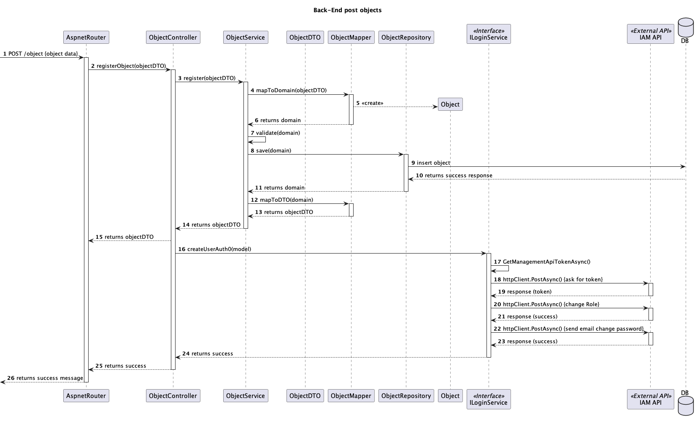

# US 5.1.1 - As Customer Manager I want to register a customer and that the system automatically creates a user for that customer

## 1. Context

*Implemented for the first time*

## 2. Requirements Engineering

### 2.1 User Story Description

**5.1.1** As Customer Manager I want to register a customer and that the system automatically creates a user for that customer

### 2.2 Client Specifications and Clarifications

### 2.3 Acceptance Criteria

* Backoffice users (e.g., doctors, nurses, technicians) are registered by an Admin via an internal
process, not via self-registration.
* Admin assigns roles (e.g., Doctor, Nurse, Technician) during the registration process.
* Registered users receive a one-time setup link via email to set their password and activate their
account.
* The system enforces strong password requirements for security.
* A confirmation email is sent to verify the user’s registration.

## 3.Design

### 3.1 System Sequence Diagram (SSD)

#### 3.1.1 Level 1

#### 3.1.2 Level 2

#### 3.1.1 Level 3

## 4.User Interface

### 4.1 Input Data

* Typed data:
    * Name
    * Email
    * Role

### 4.2 Output Data

* Registered User
* (In)Success of the operation

### 5. Dependencies/References
* n/a
 